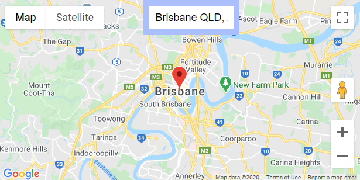

# gmaps-address-example

### This is an example of adding an address input to the [x5-gmaps](https://github.com/xon52/x5-gmaps) plugin for Vue.

### See the tutorial on [Medium](https://xon5.medium.com/vue-google-maps-and-autocomplete-e9bf0fa3c42e)

It's meant for beginners learning Vue, people wanting an example of using the x5-gmaps plugin, and those wanting a starting point for their own COVID-19 Map.
